<a id="readme-top"></a>

<h1 align="center">GitHub Flow - DevOps Showcase</h1>

---

<br />
<div align="center">
  <a href="https://github.com/carlosguerreroag/github-flow-showcase">
    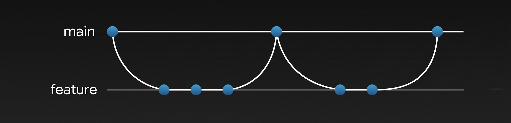
  </a>

  <p align="center">
    This repository is a personal learning project built to explore DevOps development workflows using industry-standard tools—such as AWS, Terraform, and GitHub Actions—while applying GitHub Flow principles to understand how software is built, automated, and deployed on professional environments, this project aims to simulate a production-ready VMI ecosystem designed for a Start-Up company.
    <br />
    <br />
    <a href="https://github.com/carlosguerreroag/github-flow-showcase/issues/new?labels=bug&template=bug-report---.md">Report Bug</a>
    &middot;
    <a href="https://github.com/carlosguerreroag/github-flow-showcase/issues/new?labels=enhancement&template=feature-request---.md">Request Feature</a>
  </p>
</div>

<details>
  <summary>Table of Contents</summary>
  <ol>
    <li>
      <a href="#about-the-project">About The Project</a>
      <ul>
        <li><a href="#tech-stack-used">Tech Stack Used</a></li>
        <li><a href="#project-overview">Project Overview</a></li>
      </ul>
    </li>
    <li>
      <a href="#setting-up-the-project">Setting up the project</a>
      <ul>
        <li><a href="#prerequisites">Prerequisites</a></li>
        <li><a href="#configuration---aws">Configuration - AWS</a></li>
        <li><a href="#configuration---terraform">Configuration - Terraform</a></li>
        <li><a href="#configuration---ansible">Configuration - Ansible</a></li>
        <li><a href="#configuration---github-actions">Configuration - GitHub Actions</a></li>
      </ul>
    </li>
    <li>
      <a href="#deployment--usage">Deployment & Usage</a>
      <ul>
        <li><a href="#triggering-the-workflow">Triggering the Workflow</a></li>
        <li><a href="#workflow-visualization">Workflow Visualization</a></li>
        <li><a href="#accessing-the-app">Accessing the App</a></li>
      </ul>
    </li>
    <li><a href="#contact">Contact</a></li>
    <li><a href="#acknowledgments">Acknowledgments</a></li>
  </ol>
</details>

# About The Project

This project is a hands-on exploration of the modern DevOps lifecycle and was created as a learning environment while developing my skills as a DevOps Engineer. The main goal of the project is to simulate a **minimal** cloud-based infrastructure and workflow that a Start-Up company would use, following Minimum Viable Infrastructure (MVI) principles, while also applying best practices used in real environments. It integrates tools such as AWS, Terraform, and GitHub Actions to showcase how infrastructure provisioning, automation, and version control can work together.

<p align="right">(<a href="#readme-top">back to top</a>)</p>

## Tech Stack Used


I chose these specific tools to mirror the industry standards used in enterprise production environments:
- **Infrastructure as Code (IaC)**: Using Terraform to treat AWS resources like software code, ensuring the environment is documented, versioned, and easily recreated.
- **Containerization**: Implementing Docker to package applications, ensuring that the runtime remains identical from a local developer's laptop to the production cloud environment.
- **AWS ECR**: Hosting and managing Docker images in a private container registry integrated with the CI/CD pipeline.
- **GitHub Flow**: Practicing a branch-based workflow to manage features and changes through Pull Requests.
- **Configuration Management**: Utilizing Ansible to automate the post-provisioning setup of EC2 instances, ensuring that OS-level configurations are applied consistently.

<p align="right">(<a href="#readme-top">back to top</a>)</p>

## Project Overview

### Project Overview - Application
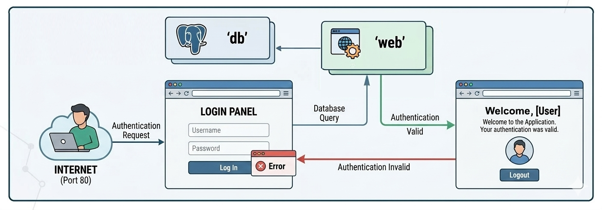

- The application consists of a super simple Python-based web application focused on providing basic user authentication. It features a straightforward login interface that validates credentials and provides access to a personalized "Welcome" dashboard upon successful authentication.
The application's infrastructure follows a classic two-tier architecture, its paired paired with a PostgreSQL ('db') instance. When a user submits their credentials via the Login Panel, the Web service performs a direct query to the Database to verify the identity. If the credentials are valid, the user is granted access; otherwise, the system triggers an error response to notify the user of the failed attempt.

<br />

### Project Overview - Docker Stack
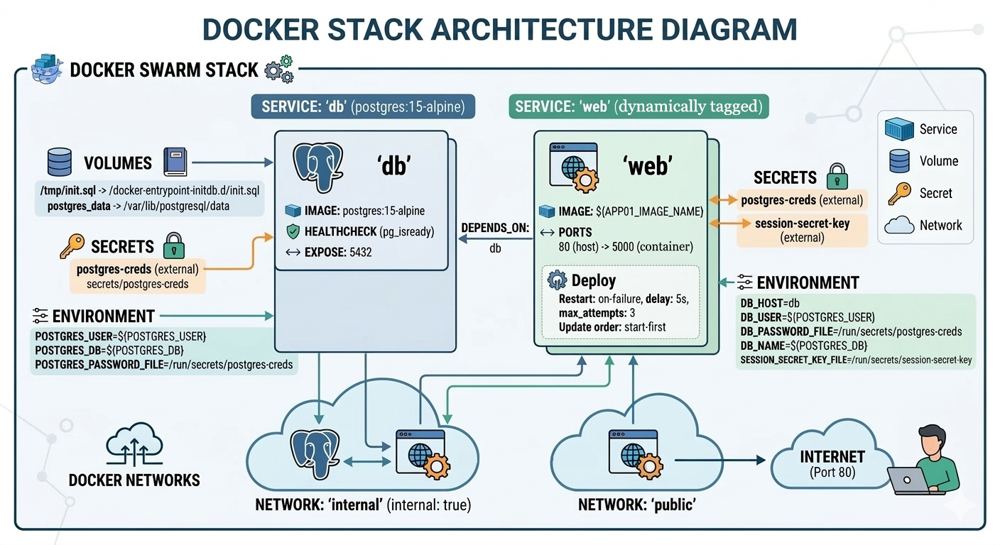

- Deployments are made using Docker Stack, which ensures that all services are isolated and easily managed as a unified system. By leveraging this orchestration, the 'web' and 'db' components run within their own dedicated containers while communicating securely over a private internal network. The application is exposed to the internet through Port 80, which serves as the primary entry point for all incoming user traffic. To ensure data reliability, the PostgreSQL service is specifically configured data persistence using a Docker Volume, keeping information safe and independent of the container’s lifecycle.

<br />

### Project Overview - AWS Resources & Environment
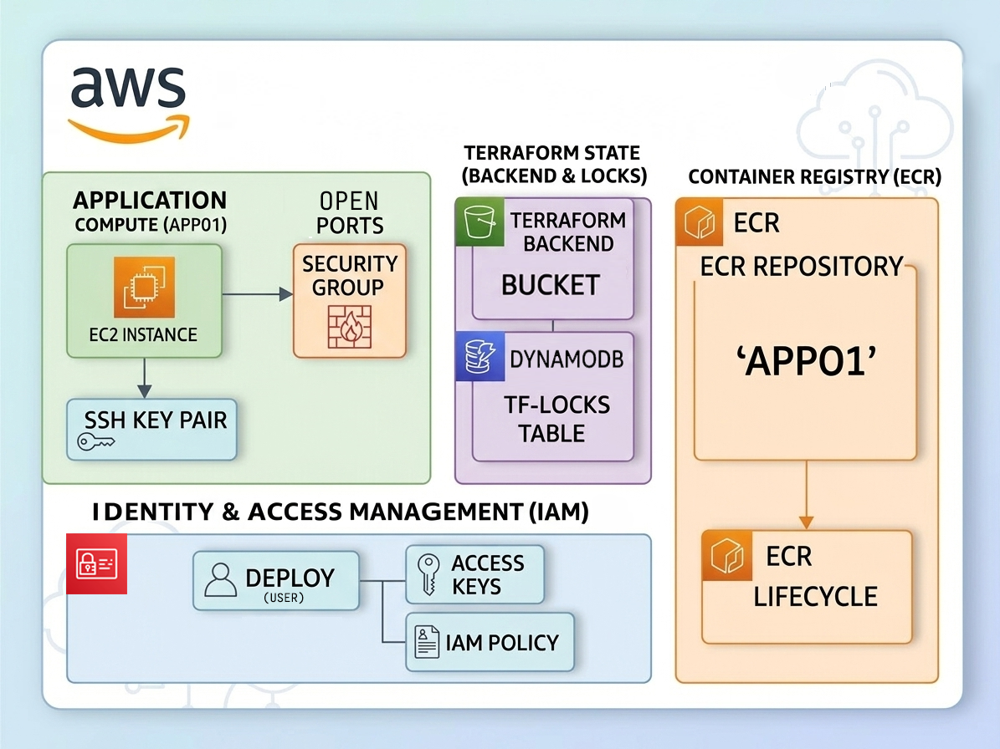
- The project’s cloud environment is provisioned and managed as Infrastructure as Code (IaC) using Terraform. This approach ensures that the AWS ecosystem is reproducible, version-controlled, and highly stable. To maintain team collaboration and prevent state corruption, the infrastructure utilizes a Remote Backend strategy: an S3 Bucket stores the Terraform state files, while a DynamoDB table handles state locking to prevent concurrent modifications.

- The application is hosted on an AWS EC2 Instance (app01), which provides the primary compute power for the Docker containers. Security is enforced at multiple these levels:
  - **Network Security**: Traffic flow is strictly regulated by Security Groups, which function as a virtual firewall to open only the necessary ports for application communication.
  - **Instance Access**: SSH Access is restricted through pubkey authentication, ensuring that only authorized developers can access the underlying server.
 
- Docker images will be stored and managed within Amazon Elastic Container Registry (ECR), a repository named 'app01' will hold the versioned Docker images, and an ECR Lifecycle policy will be implemented to automate the cleanup of obsolete images, optimizing storage costs.

- Lastly, GitHub Actions will need permissions to interact with the environment, so a dedicated IAM User named github-actions will be created. This user utilizes Access Keys to interact with AWS services, ensuring that the CI/CD pipeline or the manual deployment process has exactly the permissions required to manage the stack—and nothing more.

<br />

### Project Overview - Deployments & CI|CD
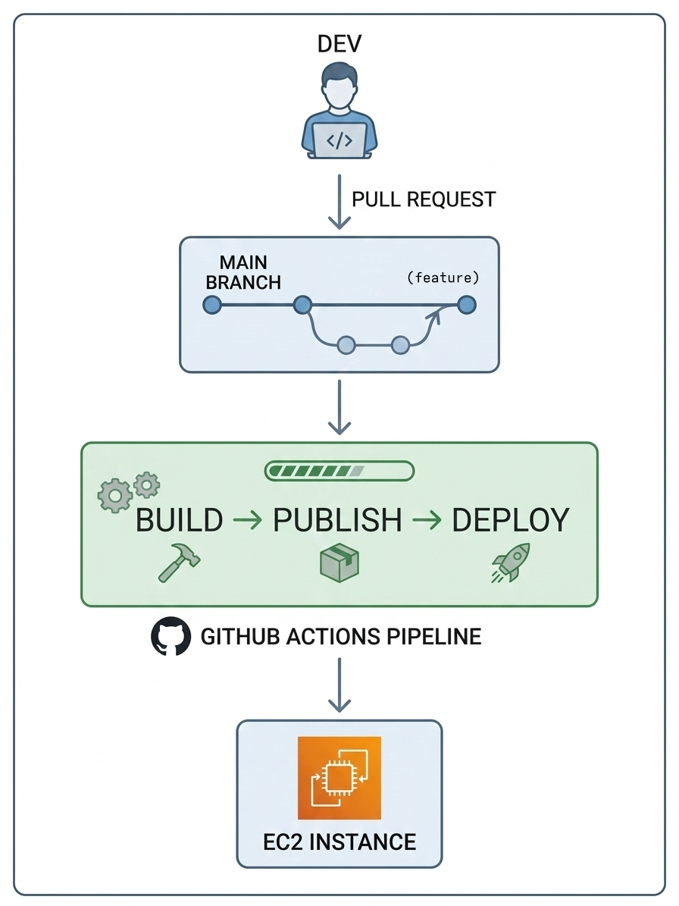
- The development process follows the GitHub Flow model, a lightweight, branch-based Git workflow designed to maintain a consistently deployable main branch. This strategy ensures that all new features and bug fixes are developed in isolation before being integrated into the production environment.

- The transition from code to production is managed by a GitHub Actions Pipeline, which automates the entire delivery lifecycle through a series of coordinated stages:
  - **Branching & Integration**: Features are developed on dedicated branches, once a task is complete, a Pull Request is submitted to the main branch. This acts as the gateway for code review and automated validation.
  - **Build & Containerization**: Upon merging into the main branch, the pipeline automatically triggers the Build stage. The application is packaged into a Docker image, ensuring that the software remains consistent across all environments.
  - **Artifact Publishing**: Once the build is verified, the pipeline Publishes the image to Amazon ECR. This creates a versioned, secure artifact that serves as the single source of truth for the deployment.
  - **Continuous Deployment**: In the final Deploy stage, GitHub Actions deploys the stack on the EC2 Instance. It signals the Docker Stack to pull the updated image and perform a rolling update, ensuring the live application reflects the latest stable code without manual intervention.

<p align="right">(<a href="#readme-top">back to top</a>)</p>


# Setting Up the Project
The following guide provides a step-by-step walkthrough to help you get a local copy of the application up and running. By following these instructions, you will configure a local development environment that replicates our containerized production architecture, allowing for consistent testing and feature development/escalation.

<p align="right">(<a href="#readme-top">back to top</a>)</p>


## Prerequisites

* [AWS Account](https://docs.aws.amazon.com/accounts/latest/reference/manage-acct-creating.html)
* [Github Account](https://docs.github.com/en/get-started/start-your-journey/creating-an-account-on-github)
* [Github Repository](https://docs.github.com/en/repositories/creating-and-managing-repositories/creating-a-new-repository)
* [Install Ansible](https://docs.ansible.com/projects/ansible/latest/installation_guide/intro_installation.html)
* [Install Terraform](https://developer.hashicorp.com/terraform/tutorials/aws-get-started/install-cli)
* Passlib Python library:
  ```sh
  pip install passlib
  ```
* Clone this repository:
  ```sh
  git clone https://github.com/carlosguerreroag/github-flow-showcase.git
  ```
  
  <p align="right">(<a href="#readme-top">back to top</a>)</p>

## Configuration - AWS

We will need to perform the following steps in AWS:

1. [Create a user with admin privileges](https://docs.aws.amazon.com/IAM/latest/UserGuide/id_users_create.html)
2. [Create Access Keys for the admin user](https://docs.aws.amazon.com/keyspaces/latest/devguide/create.keypair.html)
3. Securely store the access keys, since they are required for Terraform to create resources.

<p align="right">(<a href="#readme-top">back to top</a>)</p>

## Configuration - Terraform

After the steps above are configured, we will need to perform the following steps:

1. Edit the file terraform/accounts/main/variables.tf.

   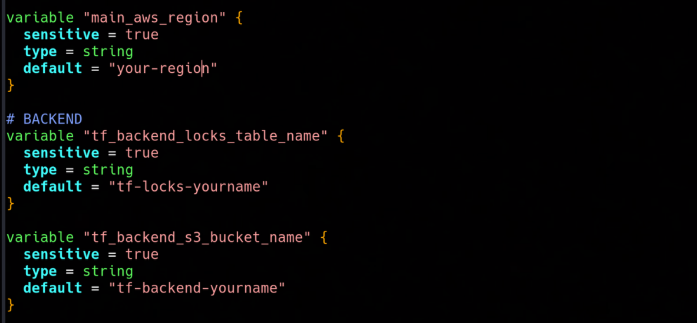
   - Set the AWS Region you'll be working on and adjust the tf_backend_locks_table_name and tf_backend_s3_bucket_name variable values.

<br />

2. Create a a terraform/accounts/main/secrets.auto.tfvars file and set your access key id and secret key values like this:

   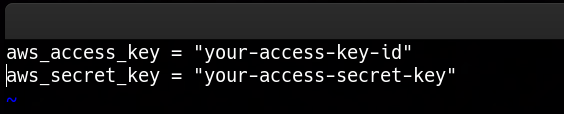
   - These values are stored like this so they don't get commited to the repository due to the .gitignore file.

<br />

3. Initialize the Terraform project:
  ```sh
  terraform init
  ```

<br />

4. Validate and deploy all the resources:
  ```sh
  terraform validate && terraform plan
  terraform apply
  ```

   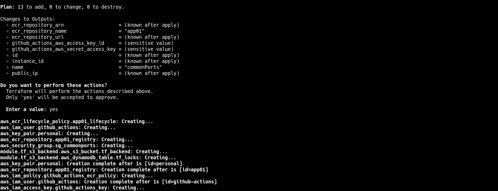

<br />

5. Edit the file terraform/accounts/main/provider.tf.

   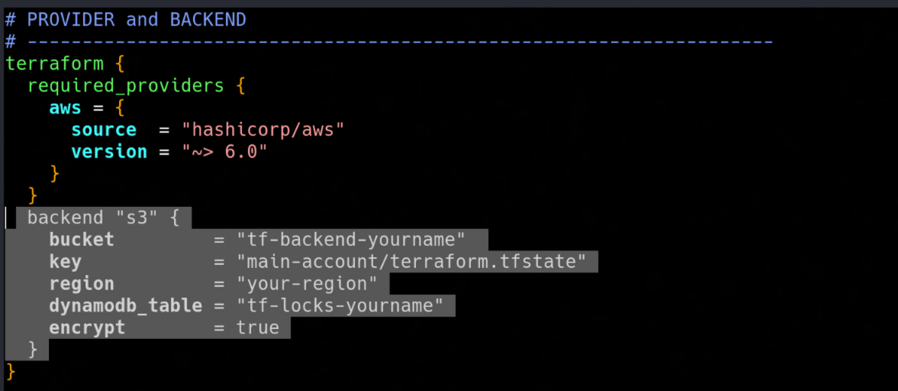
   - Uncomment the highlighted lines and ensure the value of the attributes bucket, region and dynamodb_table match the values you've set before on terraform/accounts/main/variables.tf.

<br />

6. Re-initialize the Terraform project with the -migrate-state arg:
  ```sh
  terraform init -migrate-state
  ```
   - This command configures and migrates the Terraform state to an encrypted S3 Bucket on your account, it also uses a DynamoDB table for state locking to prevent concurrent executions.

<br />

7. Look up your Terraform Outputs:
  ```sh
  terraform output
  terraform output github_actions_aws_access_key_id
  terraform output github_actions_aws_secret_access_key
  ```

   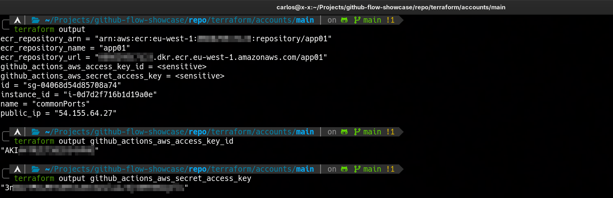
   - We will need most of these output values to configure the secrets on Github Actions and configure the EC2 instance with Ansible.

   <p align="right">(<a href="#readme-top">back to top</a>)</p>


## Configuration - Ansible

After the steps above are configured, we will need to perform the following steps:

1. Create and configure an [Ansible Vault](https://docs.ansible.com/projects/ansible/latest/vault_guide/index.html) on /etc/ansible/group_vars/all/vault.yaml, or create a plain vars file (not recommended).
2. Replicate this structure for the vault file:
   
   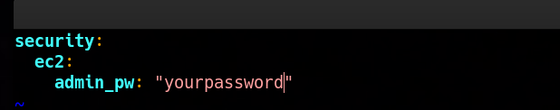
   - This variable consists of the password of the administrator user that will be created on the EC2 instance, needs to be hashed using Python passlib.

<br />
  
3. Add your freshly created EC2 instance IP to the Ansible Inventory (/etc/ansible/inventory/hosts.yaml) under the ec2-instances children group. (Optional: You can also create a domain name for your EC2 instance on R53).

<br />

4. Configure the EC2 instance with ansible-playbook:
  ```sh
  ansible-playbook /etc/ansible/playbooks/common/init.yaml
  ```
  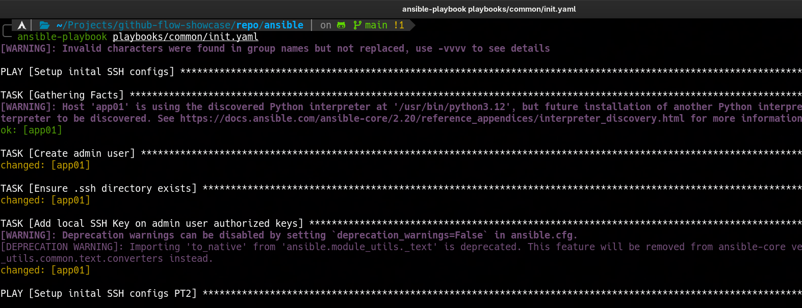
  - This will configure basic security measures on the EC2 instance, configure SSH Access with pubkey authentication, install Docker Engine and will also create another SSH Keypair that we will need to configure on GitHub to allow access to the instance from Github Actions public runners.
    
   <p align="right">(<a href="#readme-top">back to top</a>)</p>

## Configuration - Github Actions

After the steps above are configured, we will need to perform the following steps on our fresh GitHub Repository:

1. Access your Github Repository and navigate to Settings->Secrets and Variables->Actions->Variables.
2. Create the following Repository variables:
   
   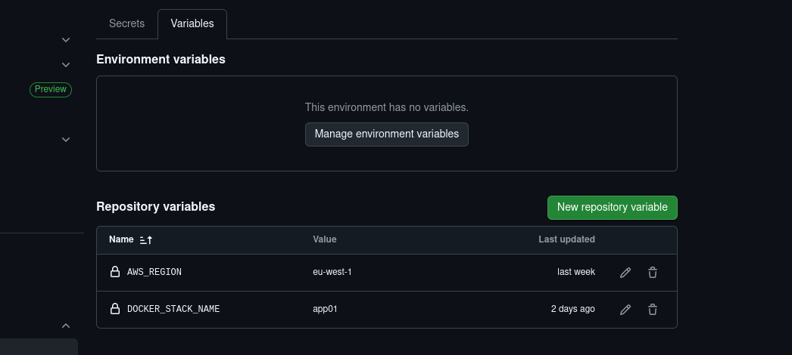
   - Adjust the AWS_REGION to the AWS region you'll be working with.

<br />

3. Change the tab to Secrets and create the following Repository variables:

   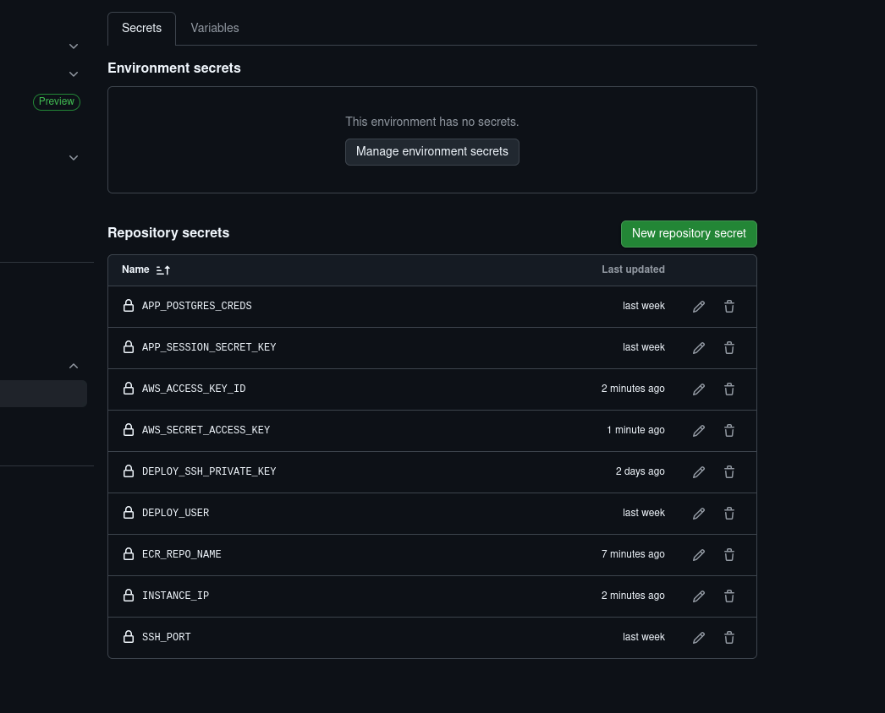
   - **APP_POSTGRES_CREDS** consists of the db password, you can copy and paste the one that is already on this repository on (docker/postgres-creds).
   - **APP_SESSION_SECRET_KEY** consists of the api session key, you can copy and paste the one that is already on this repository on (docker/session-secret-key).
   - **DEPLOY_SSH_PRIVATE_KEY** consists of the private SSH key value created for the deployment user on the EC2 instance, it will be stored on your local machine after configuring the EC2 instance with Ansible (/etc/ansible/files/home/deploy/.ssh/id_rsa_app01).
   - **DEPLOY_USER** has to match the name of the deployment user created on the EC2 instance, GitHub Actions will connect to the instance with this user and the SSH Key we set before (you can change it on Ansible).
   - **SSH_PORT** is configured on port 22 by default with Ansible, you can also change this. 

   <p align="right">(<a href="#readme-top">back to top</a>)</p>


# Deployment & Usage

Once the underlying infrastructure is provisioned and configured, the entire software lifecycle is managed through GitHub Actions. We'll see that after triggering our GitHub Actions workflow, we can simply access the application via its public URL on a browser. Deploying updates is straightforward: by following the GitHub Flow—pushing changes to a feature branch and merging a Pull Request into main—the CI/CD pipeline automatically builds, publishes, and deploys the new version to the AWS environment without any manual intervention.
But the deployment workflow only takes place after: 
- Pull Request Validation: When a PR is created or updated, a Linting Checks and Security Checks workflow are triggered automatically. Branch protection rules prevent unverified or failing code from being merged.

<p align="right">(<a href="#readme-top">back to top</a>)</p>

## Triggering the Deployment Workflow

As I mentioned before, this project follows the GitHub Flow model, the pipeline is triggered by merging verified code into the primary branch.

<br />

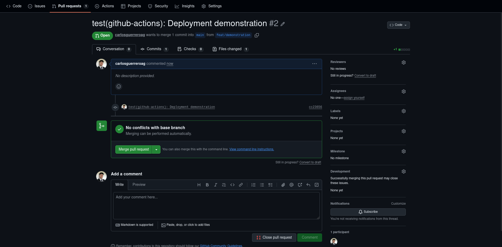
- **Opening a Pull Request**: Once new features, fixes or changes are ready, submit a Pull Request (PR) to the main branch. This acts as a formal proposal for the update and allows for a final review of the code.

<br />

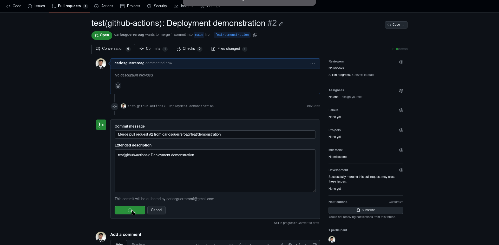

- **The Trigger (Merge)**: The moment you Merge the Pull Request into the main branch, the GitHub Actions workflow is automatically triggered and will deploy our application on the EC2 instance.

<p align="right">(<a href="#readme-top">back to top</a>)</p>

## Workflow Visualization

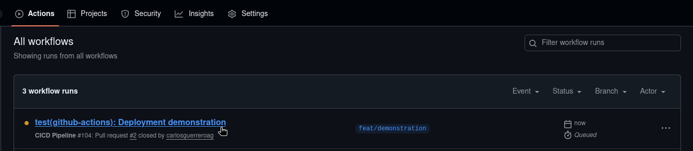
- To inspect the workflow progress after approving a Pull Request, navigate to the "Actions" tab of the repository. Here, you will find a list of recent workflow runs.

<br />

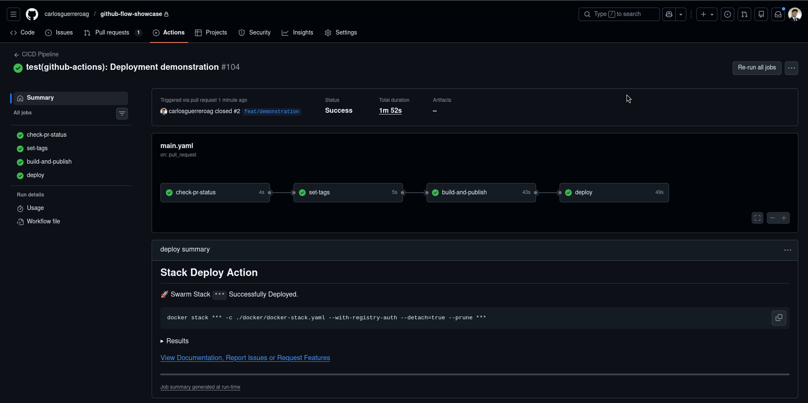
- A successful workflow run consists of four specialized jobs that ensure the integrity and delivery of the application.
  - **check-pr-status**: A safety gate that verifies the Pull Request has been properly approved before allowing any downstream automated actions.
  - **set-tags**: This job generates a dynamic, unique tag for the new version by combining the commit hash with a timestamp, ensuring full traceability of the Docker image.
  - **build-and-publish**: The core build stage where the Docker image is constructed and pushed to the Amazon ECR repository.
  - **deploy**: The final stage where the pipeline connects to the EC2 instance and triggers a Docker Stack update to roll out the new image.

<br />

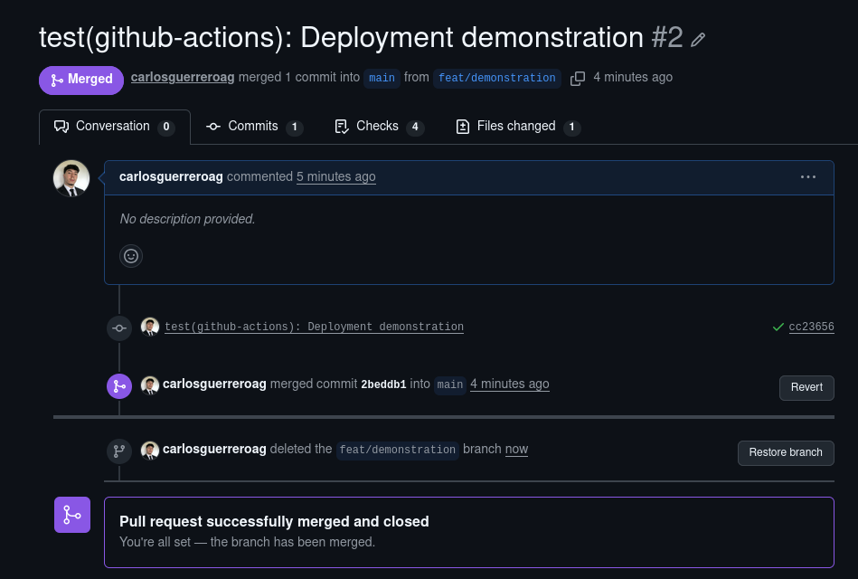
- Following the principles of GitHub Flow, once the workflow finishes successfully and the code is live, the Pull Request is marked as closed. At this stage, it is best practice to delete the merged feature branch to keep the repository clean and maintainable.

<p align="right">(<a href="#readme-top">back to top</a>)</p>

## Accessing the App

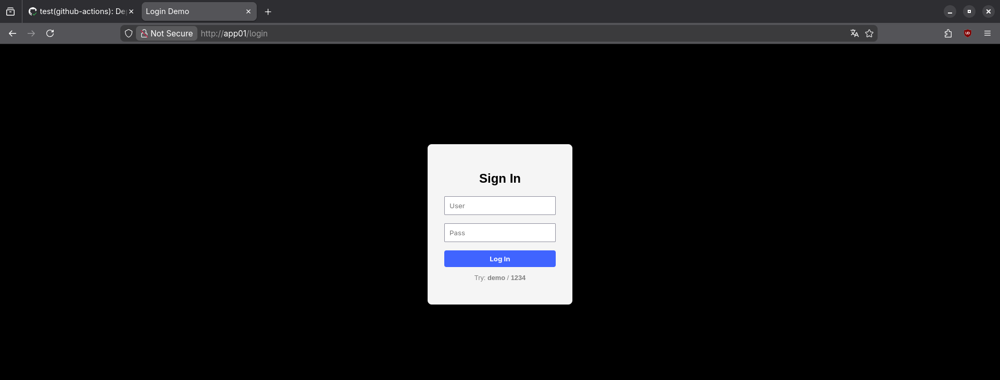
- The application is accessible via the Public IPv4 address of the AWS EC2 instance. As shown in the first capture, you will be presented with a simple login panel.

<br />

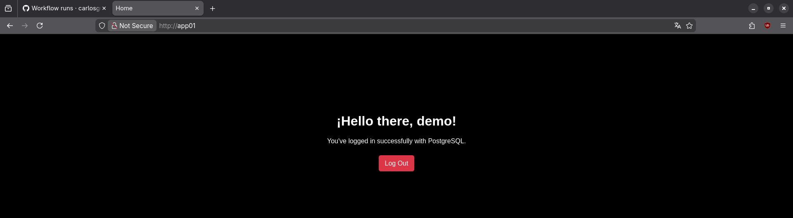
- By entering the authorized credentials stored within the PostgreSQL database, the app redirects you to the "Welcome" dashboard. This confirms that the Docker containers are communicating correctly and that the database is successfully managing user identities.

<p align="right">(<a href="#readme-top">back to top</a>)</p>

# Contact

* [My LinkedIn](https://linkedin.com/in/carlosguerreroaguilera/)
* [Project Link](https://github.com/carlosguerreroag/github-flow-showcase)

<p align="right">(<a href="#readme-top">back to top</a>)</p>


# Acknowledgments

These are a list of links of resources I found helpful while doing this project and would like to give credit to!

* [Dreams of Code - YouTube](https://www.youtube.com/@dreamsofcode)
* [DaveOps - YouTube](https://www.youtube.com/daveops)

<p align="right">(<a href="#readme-top">back to top</a>)</p>
